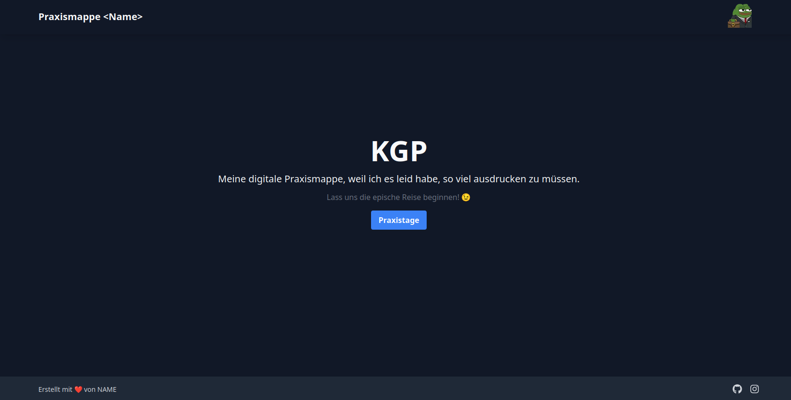
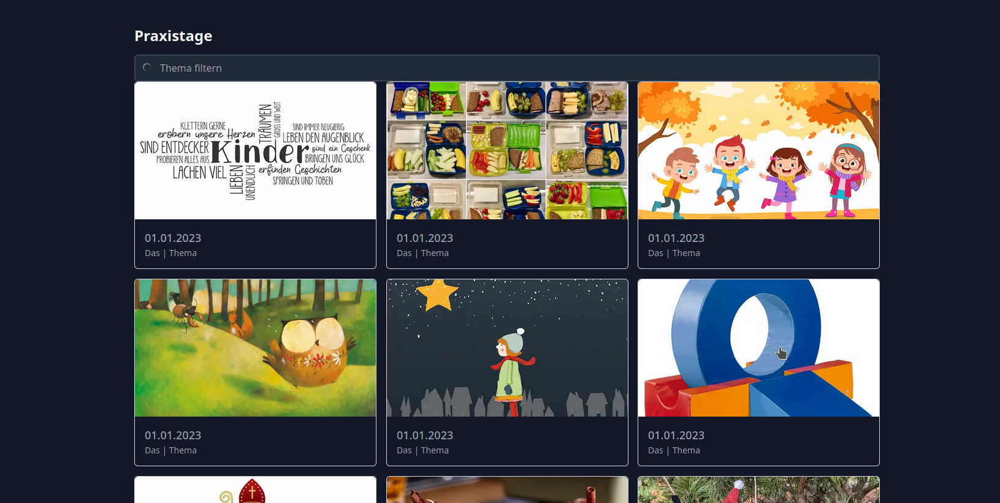
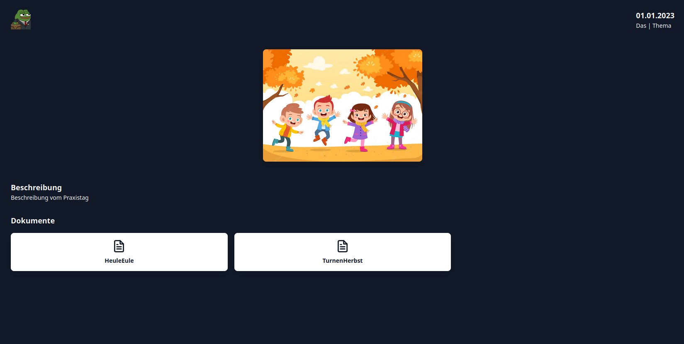
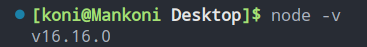
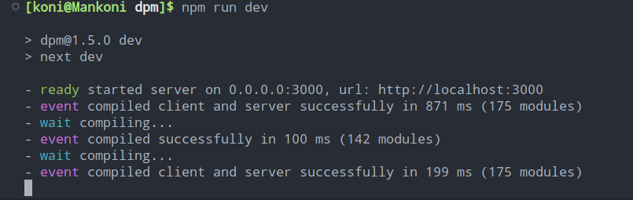

## <p align="center">Digitale Praxismappe</p>

[](https://discord.gg/nv8Nc55u4r)
[](https://twitter.com/vkxni)
[](https://github.com/alelievr/Mixture/blob/master/LICENSE)

<p align="center">
</a>
<p>

## Der Einfall 😇

Viele Personen, welche im Bereich der Elementarpädagogik tätig sind, sind mit einer bekannten Problematik konfrontiert. <br>
Es handelt sich hierbei um überfüllte und schwere Ordner, welche mit einer Vielzahl von Planungen, Reflexionen und weiteren Dokumenten gefüllt sind. Oftmals greift man hierbei auf Klarsichtfolien oder -hüllen zurück, um wichtige Dokumente oder Trennblätter zu schützen. <br>
Einige Personen nutzen sogar das Verfahren der Laminierung, um eine höhere Strapazierfähigkeit zu erreichen. Des Weiteren führt die Ausdruckung von Bildern ohne Farbe zu unzureichenden Ergebnissen.
<br>
Dieser Kreislauf führt zu einer finanziellen Belastung und stellt auch für Personen, welche für die Verwaltung oder Einsichtnahme der Ordner verantwortlich sind, eine Herausforderung dar. <br>
Aus ökonomischen und ökologischen Gründen stellt sich somit die Frage, ob es nicht besser wäre, die Dokumentation der jeweiligen Praxistage digital zu führen.

Dashboard
<p align="center">
</a>
<p>

Praxistag
<p align="center">
</a>
<p>

## Wie? 🤔

Ganz einfach, hier steht eine kostenlose, "self-hostable" Version einer einfachen - digitalen - Praxismappe zur Verfügung. Hierzu folgt eine Anleitung zum Aufsetzen auf Ihrem Windows 10/11 Computer.

> Schritt 1

Dieses Projekt wurde mit NodeJS, TypeScript sowie der Hilfe von NodeJS und NPM entwickelt. Hierfür benötigen Sie einige Installationen.

- NodeJS installieren

[Wählen Sie hier den "Windows Installer" aus](https://nodejs.org/de/download)

- Verifizieren, ob NodeJS korrekt installiert wurde

```bash
node -v
```

<p align="left">
</a>
<p>

Dieser Befehl wurde im Terminal ausgeführt: [https://learn.microsoft.com/de-de/windows/terminal/faq](https://learn.microsoft.com/de-de/windows/terminal/faq)

> Schritt 2

- **NPM installieren**

NPM ist der "Node Package Manager", mit dem können wir überall, aus der ganzen Welt, öffentliche Pakete auf unserem Gerät installieren. Hierzu einfach dem Befehl folgen.

```bash
npm install -g npm
```

Oder auch: https://docs.npmjs.com/downloading-and-installing-node-js-and-npm

> Schritt 3

- **NextJS installieren**

Nun müssen wir die Entwicklungsumgebung für die Website, NextJS installieren. Hierzu einfach dem Befehl folgen.

```bash
npm i create-next-app@latest
```

> Schritt 4

- **Github Konto erstellen**

Sie befinden sich hier auf der Plattform "GitHub", unter dem Besitz von Microsoft. Falls Sie noch kein Konto besitzen: [https://github.com](https://github.com) und dann ein neues Konto erstellen.

> Schritt 5 (optional)

- **Git installieren**

Um schneller und effizienter mit der Website und GitHub zu arbeiten (für Fortgeschrittene): [https://git-scm.com/book/de/v2](https://git-scm.com/book/de/v2)

> Schritt 6

- **Quellcode herunterladen**

Um die Website für sie selbst zur Verfügung zu stellen, muss sie erst heruntergeladen werden.

Gehe hierzu hoch zu [https://github.com/bafep/praxismappe](https://github.com/bafep/praxismappe) und klicke auf den großen, grünen Knopf "Code".
Diesen ausgewählt, steht ganz unten "ZIP herunterladen" bzw. "Download ZIP". Dies wird eine ZIP Datei mit allen Dateien herunterladen.

Sobald dies geschehen ist, muss die ZIP Datei nur mehr Entpackt werden (mit Tools wie WinRAR oder offiziellen Windows Tools (rechtsklick -> entpacken) ist dies natürlich auch möglich).

> Schritt 7

- Entwicklungsumgebung herunterladen

Nun fehlt es nur mehr an einem Program, mit dem man ganz einfach den Quellcode der Website bearbeiten kann, ganz nach seinem Geschmack. Das ist unser wichtigstes Werkzeug.

[Visual Studio Code](https://code.visualstudio.com/) hier einfach auf "Download" klicken, dann wird man durch den Prozess hindurch begleitet.

> Schritt 8

- Website vorbereiten

Der entpackte Ordner muss nur mehr in Visual Studio Code geöffnet werden, dabei kann man diesen einfach in das Fenster hineinziehen (per Drag-and-Drop) oder auch via "Ordner öffnen" und den jeweiligen Projektordner auswählen.

Sobald dies geschehen ist, muss die Kommandozeile geöffnet werden.

Via Windows CMD im Ordner, oder `STRG` + `SHIFT` + `P` und dort dann `> Terminal` eingeben, "Neues Terminal erstellen" (o.s.ä) auswählen.

Alle Pakete, die für die Website erforderlich sind, herunterladen:

```bash
npm install
```

> Schritt 9

- Website starten

Im Terminal diesen Befehl ausfühen:

```bash
npm run dev
```

<p align="left">
</a>
<p>

Nun ist die Website, lokal für uns verfügbar. Hierzu einfach im Browser die folgende Addresse eingeben:

[http://localhost:3000](http://localhost:3000), dort sollte dann die Website erscheinen.

> Schritt 10

- Daten ändern

Im Projektordner befindet sich ein Ordner `lib` und dort darin liegt eine Datei `head.ts`. Diese sind all die festgelegten Texte, Überschriften etc. die man auf der Website finden kann. Dort können Sie ganz einfach, ohne Probleme die jeweiligen Texte verändern und anpassen. Achtung! Nach jeder Änderung muss `STRG` + `S` oder "Datei" -> "Speichern" gedrückt werden.

> Schritt 11

- Praxis

Im Projektordner befindet sich ein Ordner `public` und dort darin liegt `praxistage` - das Herzstück! Dort drinnen sind alle Praxistage festgelegt. Dort werden alle Dokumente (.docx, .pdf) aber auch Bilder hineingelegt und somit in die Website eingebunden.
Es wird empfohlen, nicht all zu lange Namen für die jeweiligen Dokumente festzulegen.

Zusätzlich, zur Vereinfachung, gibt es die Möglichkeit, Deckblätter für jeden Praxistag hinzuzufügen. Dies geschiet im Ordner `deckblatt`, wo für jeden Praxistag ein `.png` Bild festgelegt ist.

> Schritt 12

- Website hochladen

Um die Website öffentlich ins Internet zu stellen, muss sie zuerst auf GitHub geladen und danach auf Plattformen wie Vercel oder Netlify "gehosted" werden.

Hierzu zurück auf: [https://github.com/new](https://github.com/new), dann einen Namen auswählen für die Online-Mappe und "Privat" unterhalb auswählen, danach ganz nach unten auf "Erstellen".

Nachdem dies passiert ist, kann ganz einfach die ganze Mappe hochgeladen werden. Dazu einfach auf den kleinen blauen Text "uploading an existing file" klicken und den Ordner bzw. alle Dateien hineinziehen.

Danach auf [https://vercel.com](https://vercel.com) gehen, mit bestehendem GitHub Konto anmelden. Danach auf "Add New" und dort sollte dann, nachdem "Projekt" ausgewählt wurde, das neu erstelle Projekt aufscheinen. Mit "Import" bestätigen, optional einen Namen auswählen und "Deploy" klicken.

Bei weiteren Änderungen, wenn etwas hinzugefügt oder gelöscht wird, wird empfohlen, dies direkt über GitHub zu tun, da es via der Kommandozeile ein erweitertes Wissen mit `git` benötigt. Danke für das Verständnis. 

## Mögliche Fehlermeldungen

```
.\skript.ps1 : Die Datei "C:\work\skript.ps1" kann nicht geladen werden, da die Ausführung von Skripts auf
diesem System deaktiviert ist. Weitere Informationen finden Sie unter "about_Execution_Policies"
(https:/go.microsoft.com/fwlink/?LinkID=135170).
In Zeile:1 Zeichen:1
+ .\skript.ps1
+ ~~~~~~~~~~~~~~~
    + CategoryInfo          : Sicherheitsfehler: (:) [], PSSecurityException
    + FullyQualifiedErrorId : UnauthorizedAccess
```

=> https://www.lycantec.com/wissen/scripting/powershell-skript-kann-nicht-geladen-werden/

=> https://stackoverflow.com/questions/63423584/how-to-fix-error-nodemon-ps1-cannot-be-loaded-because-running-scripts-is-disabl

=> `Set-ExecutionPolicy -ExecutionPolicy RemoteSigned -Scope CurrentUser` (PowerShell Administrator)

--- 

*Ich biete auch eine Installation und Wartung an, dies ist jedoch wegen des Zeitaufwandes nicht immer möglich sowie kostenfrei.*

© BAfEP Hartberg 2022, [MIT Licence](/LICENSE), von [@vKxni](https://github.com/vKxni).
